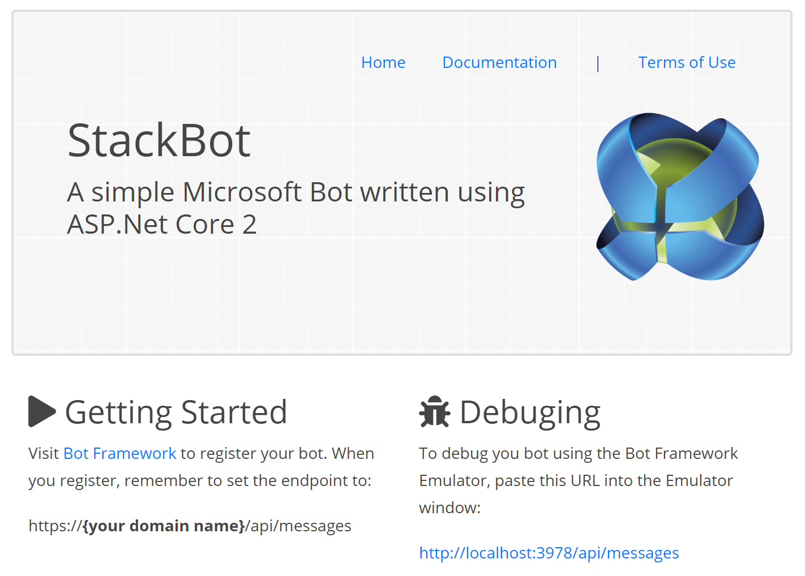

StackBot Project
========

StackBot helps user locate technical information about questions asked on Stack Overflow. This is my first time looking into the MS Bot/Cognative frameworks.  

---
Features
--------
*	 Uses LUIS services to determine search intent and entities
*    Returns a list of Stack Overflow links

Included Libraries
--------
##### External Dependencies

*    Microsoft ASP.NET Core v2.0
*    Microsoft Bot Framework Alpha 4
*    Microsoft LUIS API v2.0
*    Slack Overflow API v2.2
*    GitHub API v3

---
Next Steps 
-------
*    Results Paging via LUIS intent
*    GitHub integration
*    Additional LUIS training
*    Add my custom ML based memory pathways to better anticipate users needs
*    Use my custom ML to make help make differential solutions and suggestions

